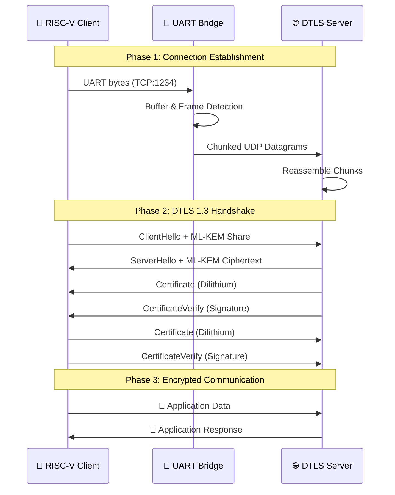

<p align="center">
  
  
  
</p>

<h1 align="center">
  🔐 PQC-DTLS 1.3 for Constrained IoT Devices
</h1>

<p align="center">
  <b>Quantum-Resistant Secure Communication for Bare-Metal RISC-V Embedded Systems</b>
</p>

<p align="center">
  
  
  
  
</p>

<p align="center">
  <i>🏆 Developed for Inter IIT Tech Meet 14.0 | Problem Statement by Q-trino Labs</i>
</p>

---

<p align="center">
  
  
  
</p>

---

## 🌟 Highlights

<table>
<tr>
<td width="50%">

### 🛡️ Quantum-Resistant Security
- **ML-KEM-512 (Kyber)** for key exchange
- **Dilithium Level 2** for digital signatures  
- NIST FIPS 203/204 compliant algorithms

</td>
<td width="50%">

### 🔧 Bare-Metal Implementation
- Zero OS dependency
- BIOS-level operation on RISC-V
- ~420 KB firmware footprint

</td>
</tr>
<tr>
<td width="50%">

### 🔄 Robust Packet Handling
- Custom chunked UDP protocol
- CRC16 integrity verification
- Automatic packet reassembly

</td>
<td width="50%">

### 🔐 Mutual Authentication
- Certificate-based identity verification
- Bi-directional trust establishment
- Production-ready security model

</td>
</tr>
</table>

---

## 📋 Table of Contents

- [Overview](#-overview)
- [System Architecture](#-system-architecture)
- [DTLS 1.3 Handshake Flow](#-dtls-13-handshake-flow)
- [Chunked Middleware Protocol](#-chunked-middleware-protocol)
- [Cryptographic Algorithms](#-cryptographic-algorithms)
- [Installation](#-installation)
- [Quick Start](#-quick-start)
- [Project Structure](#-project-structure)
- [Performance Metrics](#-performance-metrics)
- [Testing & Verification](#-testing--verification)
- [Troubleshooting](#-troubleshooting)
- [References](#-references)

---

## 🎯 Overview

This project implements a **complete Post-Quantum Cryptographic (PQC) DTLS 1.3 stack** for resource-constrained IoT devices. It addresses the critical challenge of securing embedded systems against **future quantum computing threats** while operating under severe memory and computational constraints.

### Key Achievement

> ✅ **Successful mutual authentication and encrypted communication** between a bare-metal RISC-V IoT device and server using NIST-approved post-quantum cryptographic algorithms.

### Why Post-Quantum Now?

```
┌─────────────────────────────────────────────────────────────────────┐
│                    🚨 HARVEST NOW, DECRYPT LATER                     │
├─────────────────────────────────────────────────────────────────────┤
│  Adversaries are collecting encrypted data TODAY that they will    │
│  decrypt when quantum computers become available (estimated 2030)   │
│                                                                     │
│  IoT devices deployed NOW may still be operational when this       │
│  threat materializes - they MUST use quantum-resistant crypto      │
└─────────────────────────────────────────────────────────────────────┘
```

---

## 🏗️ System Architecture

```
                                    ┌──────────────────────────────────┐
                                    │        ARCHITECTURE OVERVIEW      │
                                    └──────────────────────────────────┘

┌───────────────────────────────┐         ┌──────────────────────────────┐         ┌───────────────────────────────┐
│                               │         │                              │         │                               │
│   🖥️ RISC-V SIMULATION        │         │   🔄 UART-UDP BRIDGE         │         │   🌐 DTLS PQC SERVER          │
│   (LiteX + Verilator)         │  UART   │   (Python Middleware)        │   UDP   │   (Native x86 Binary)         │
│                               │◄───────►│                              │◄───────►│                               │
│   ┌─────────────────────┐     │  TCP    │   ┌──────────────────────┐   │  4444   │   ┌─────────────────────┐     │
│   │ VexRiscv CPU @ 10MHz│     │  1234   │   │ Chunked Protocol     │   │         │   │ wolfSSL 5.6+        │     │
│   │ 100 MB RAM          │     │         │   │ ├─ Packet Framing    │   │         │   │ ├─ DTLS 1.3         │     │
│   │ 32 KB ROM           │     │         │   │ ├─ CRC16 Validation  │   │         │   │ ├─ ML-KEM-512       │     │
│   └─────────────────────┘     │         │   │ └─ Auto Reassembly   │   │         │   │ └─ Dilithium L2     │     │
│                               │         │   └──────────────────────┘   │         │   └─────────────────────┘     │
│   ┌─────────────────────┐     │         │                              │         │                               │
│   │ DTLS 1.3 Client     │     │         │   ┌──────────────────────┐   │         │   ┌─────────────────────┐     │
│   │ ├─ wolfSSL          │     │         │   │ Handles Large Msgs   │   │         │   │ Certificate         │     │
│   │ ├─ PQC Algorithms   │     │         │   │ ├─ 5KB+ DTLS records │   │         │   │ ├─ CA Verification  │     │
│   │ └─ Embedded Certs   │     │         │   │ └─ Multi-chunk split │   │         │   │ └─ Mutual Auth      │     │
│   └─────────────────────┘     │         │   └──────────────────────┘   │         │   └─────────────────────┘     │
│                               │         │                              │         │                               │
└───────────────────────────────┘         └──────────────────────────────┘         └───────────────────────────────┘
         │                                              │                                        │
         │                                              │                                        │
         └──────────────────────────────────────────────┴────────────────────────────────────────┘
                                                  │
                                    ┌─────────────▼──────────────┐
                                    │   🔒 SECURE CHANNEL        │
                                    │   AES-128-GCM Encrypted    │
                                    │   Post-Quantum Protected   │
                                    └────────────────────────────┘
```

### Component Interaction Flow



---

## 🤝 DTLS 1.3 Handshake Flow

The handshake follows RFC 9147 (DTLS 1.3) with post-quantum cryptographic extensions:

```
┌──────────────────────────────────────────────────────────────────────────────────┐
│                        DTLS 1.3 PQC HANDSHAKE SEQUENCE                           │
└──────────────────────────────────────────────────────────────────────────────────┘

    Client (RISC-V IoT Device)                        Server (Linux Host)
           │                                                 │
           │                                                 │
    ┌──────┴──────┐                                   ┌──────┴──────┐
    │  Generate   │                                   │   Waiting   │
    │ ML-KEM Keys │                                   │ for Client  │
    └──────┬──────┘                                   └──────┬──────┘
           │                                                 │
           │  ┌─────────── ClientHello ─────────────────►   │
           │  │  • Client Random (32 bytes)                  │
           │  │  • Cipher Suites (TLS_AES_128_GCM_SHA256)    │
           │  │  • ML-KEM Public Key (1184 bytes)            │
           │  │  • Dilithium Signature Algorithms            │
           │                                                 │
           │  ◄─────────── ServerHello ──────────────────┐  │
           │               • Server Random (32 bytes)    │  │
           │               • Selected Cipher Suite       │  │
           │               • ML-KEM Ciphertext (1088 B)  │  │
           │                                             │  │
           │  ◄───────── EncryptedExtensions ────────────┤  │
           │               • (encrypted from here)       │  │
           │                                             │  │
           │  ◄─────────── Certificate ──────────────────┤  │
           │               • Server Dilithium Cert       │  │
           │               • Public Key (1952 bytes)     │  │
           │                                             │  │
           │  ◄────────── CertificateVerify ─────────────┤  │
           │               • Dilithium Signature         │  │
           │               • (3293 bytes)                │  │
           │                                             │  │
           │  ◄───────────── Finished ───────────────────┘  │
           │               • Handshake MAC                   │
           │                                                 │
    ┌──────┴──────┐        ┌──────────────────────┐         │
    │   Verify    │        │ Derive Session Keys  │         │
    │   Server    │───────►│ • Client Write Key   │         │
    │ Certificate │        │ • Server Write Key   │         │
    └──────┬──────┘        │ • Traffic Secrets    │         │
           │               └──────────────────────┘         │
           │                                                 │
           │  ───────────── Certificate ────────────────►   │
           │               • Client Dilithium Cert          │
           │                                                 │
           │  ──────────── CertificateVerify ───────────►   │
           │               • Client Signature               │
           │                                                 │
           │  ─────────────── Finished ─────────────────►   │
           │                                                 │
           │                   ┌──────────────────┐         │
           │                   │ Verify Client &  │◄────────│
           │                   │ Derive App Keys  │         │
           │                   └────────┬─────────┘         │
           │                            │                    │
           ├────────────────────────────┼────────────────────┤
           │                            │                    │
           │   ═══════════════ SECURE CHANNEL ═══════════   │
           │                            │                    │
           │  ◄══════════ Encrypted Application Data ═════► │
           │         (AES-128-GCM with Perfect Forward       │
           │          Secrecy & Quantum Resistance)          │
           │                                                 │
    ┌──────┴──────┐                                   ┌──────┴──────┐
    │   ✓ SECURE  │                                   │   ✓ SECURE  │
    │  CONNECTED  │                                   │  CONNECTED  │
    └─────────────┘                                   └─────────────┘
```

### Key Exchange Details

```
┌─────────────────────────────────────────────────────────────────┐
│                   ML-KEM-512 KEY EXCHANGE                       │
├─────────────────────────────────────────────────────────────────┤
│                                                                 │
│  Client                              Server                     │
│    │                                   │                        │
│    │  1. Generate ephemeral            │                        │
│    │     keypair (pk, sk)              │                        │
│    │         │                         │                        │
│    │         │                         │                        │
│    │  2. Send public key ─────────────►│  3. Encapsulate        │
│    │     (1184 bytes)                  │     shared secret      │
│    │                                   │         │              │
│    │                                   │         │              │
│    │  4. Receive ciphertext ◄──────────│  (1088 bytes)          │
│    │                                   │         │              │
│    │  5. Decapsulate to                │         │              │
│    │     get shared secret             │         │              │
│    │         │                         │         │              │
│    │         ▼                         │         ▼              │
│    │  ┌─────────────────────────────────────────────────────┐   │
│    │  │            IDENTICAL 32-BYTE SHARED SECRET          │   │
│    │  │     (Used as input to HKDF for session keys)        │   │
│    │  └─────────────────────────────────────────────────────┘   │
│                                                                 │
└─────────────────────────────────────────────────────────────────┘
```

---

## 🔄 Chunked Middleware Protocol

### The Problem

Large DTLS records (especially with PQC certificates ~5KB+) cannot be transmitted reliably over constrained UART-to-UDP bridges:

```
❌ PROBLEM: Raw transmission causes garbled data

     TCP Stream (UART)              UDP Datagrams
    ┌─────────────────┐            ┌──────────┐
    │AAABBBCCCDDDEEE..│───────────►│AAA???????│ ← Data Lost!
    │(continuous flow)│            │BBB???????│ ← Corrupted!
    └─────────────────┘            │DDDEE?????│ ← Out of order!
                                   └──────────┘
```

### The Solution: Chunked UDP Protocol

We implemented a **custom framing protocol** with 16-byte headers for reliable transmission:

```
┌──────────────────────────────────────────────────────────────────────────┐
│                     CHUNKED UDP PROTOCOL FRAME FORMAT                     │
├──────────────────────────────────────────────────────────────────────────┤
│                                                                          │
│   Header (16 bytes)                         Payload (up to 1400 bytes)   │
│  ┌─────────────────────────────────────────┐ ┌─────────────────────────┐ │
│  │ Magic │ MsgID │ChunkID│ Total │ Len │CRC│ │     Actual DTLS Data    │ │
│  │  4B   │  4B   │  2B   │  2B   │ 2B  │2B │ │                         │ │
│  └─────────────────────────────────────────┘ └─────────────────────────┘ │
│                                                                          │
│  Field Descriptions:                                                     │
│  ───────────────────                                                     │
│  • Magic (0xCDAB1234) - Protocol identifier for validation               │
│  • Message ID        - Unique identifier for each DTLS record            │
│  • Chunk ID          - Current chunk number (0-indexed)                  │
│  • Total Chunks      - Total number of chunks for this message           │
│  • Chunk Length      - Payload size in this datagram                     │
│  • CRC16             - Integrity checksum of payload                     │
│                                                                          │
└──────────────────────────────────────────────────────────────────────────┘
```

### Transmission Example

```
┌──────────────────────────────────────────────────────────────────────────┐
│              5KB DTLS CERTIFICATE TRANSMISSION EXAMPLE                   │
└──────────────────────────────────────────────────────────────────────────┘

Original Message: 5000 bytes DTLS Certificate Record
Max Chunk Size:   1400 bytes
Chunks Required:  ⌈5000 / 1400⌉ = 4 chunks

┌────────────────────────────────────────────────────────────────────────┐
│ CHUNK 0/3                                                              │
│ ┌──────────────────────────┬──────────────────────────────────────┐    │
│ │ Magic:     0xCDAB1234    │ Payload: Bytes 0-1399 of certificate │    │
│ │ Msg ID:    42            │ (1400 bytes)                         │    │
│ │ Chunk ID:  0             │                                      │    │
│ │ Total:     4             │                                      │    │
│ │ Length:    1400          │                                      │    │
│ │ CRC16:     0xA3F2        │                                      │    │
│ └──────────────────────────┴──────────────────────────────────────┘    │
└────────────────────────────────────────────────────────────────────────┘

┌────────────────────────────────────────────────────────────────────────┐
│ CHUNK 1/3                                                              │
│ ┌──────────────────────────┬──────────────────────────────────────┐    │
│ │ Magic:     0xCDAB1234    │ Payload: Bytes 1400-2799             │    │
│ │ Msg ID:    42            │ (1400 bytes)                         │    │
│ │ Chunk ID:  1             │                                      │    │
│ │ Total:     4             │                                      │    │
│ │ Length:    1400          │                                      │    │
│ │ CRC16:     0x7B91        │                                      │    │
│ └──────────────────────────┴──────────────────────────────────────┘    │
└────────────────────────────────────────────────────────────────────────┘

┌────────────────────────────────────────────────────────────────────────┐
│ CHUNK 2/3                                                              │
│ ┌──────────────────────────┬──────────────────────────────────────┐    │
│ │ Magic:     0xCDAB1234    │ Payload: Bytes 2800-4199             │    │
│ │ Msg ID:    42            │ (1400 bytes)                         │    │
│ │ Chunk ID:  2             │                                      │    │
│ │ Total:     4             │                                      │    │
│ │ Length:    1400          │                                      │    │
│ │ CRC16:     0x2E44        │                                      │    │
│ └──────────────────────────┴──────────────────────────────────────┘    │
└────────────────────────────────────────────────────────────────────────┘

┌────────────────────────────────────────────────────────────────────────┐
│ CHUNK 3/3 (Final)                                                      │
│ ┌──────────────────────────┬──────────────────────────────────────┐    │
│ │ Magic:     0xCDAB1234    │ Payload: Bytes 4200-4999             │    │
│ │ Msg ID:    42            │ (800 bytes - final chunk)            │    │
│ │ Chunk ID:  3             │                                      │    │
│ │ Total:     4             │                                      │    │
│ │ Length:    800           │                                      │    │
│ │ CRC16:     0xD127        │                                      │    │
│ └──────────────────────────┴──────────────────────────────────────┘    │
└────────────────────────────────────────────────────────────────────────┘

                                    ↓
                           ┌───────────────┐
                           │  REASSEMBLY   │
                           │   at Server   │
                           └───────┬───────┘
                                   ↓
                    ┌──────────────────────────────┐
                    │ ✓ Complete 5000-byte record  │
                    │   ready for DTLS processing  │
                    └──────────────────────────────┘
```

### Reassembly State Machine

```
┌─────────────────────────────────────────────────────────────────────┐
│                    RECEIVER STATE MACHINE                           │
└─────────────────────────────────────────────────────────────────────┘

                      ┌─────────────────┐
                      │   IDLE STATE    │
                      │ (No active msg) │
                      └────────┬────────┘
                               │
                               │ Receive Chunk (Msg ID = N)
                               ▼
                      ┌─────────────────┐
               ┌─────►│  RECEIVING      │◄──────┐
               │      │ Message ID: N   │       │
               │      │ Got: 1/4 chunks │       │
               │      └────────┬────────┘       │
               │               │                │
               │               │ More chunks    │
               │               ▼                │
               │      ┌─────────────────┐       │
               │      │  ACCUMULATING   │───────┘
               │      │ Got: 2/4, 3/4   │  Still incomplete
               │      └────────┬────────┘
               │               │
               │               │ Final chunk received (4/4)
               │               ▼
               │      ┌─────────────────┐
               │      │   COMPLETE!     │
               │      │ ✓ CRC verified  │
               │      │ ✓ All chunks    │
               │      │ → Reassemble    │
               │      └────────┬────────┘
               │               │
               │               │ Return complete message
               │               ▼
               │      ┌─────────────────┐
               │      │ DELIVER TO      │
               └──────│ DTLS STACK      │
                      │ (wolfSSL)       │
                      └─────────────────┘
```

### Protocol Benefits

| Feature | Benefit |
|---------|---------|
| **Magic Number** | Reject non-protocol packets |
| **Message ID** | Track concurrent multi-message streams |
| **Chunk ID** | Ensure correct reassembly order |
| **Total Chunks** | Know when message is complete |
| **CRC16** | Detect corrupted chunks |
| **Timeout Handling** | Clean up incomplete messages |

---

## 🔐 Cryptographic Algorithms

### Algorithm Suite

```
┌──────────────────────────────────────────────────────────────────────────┐
│                    POST-QUANTUM CRYPTOGRAPHIC SUITE                       │
├──────────────────────────────────────────────────────────────────────────┤
│                                                                          │
│  ┌───────────────────────────────────────────────────────────────────┐   │
│  │                    ML-KEM-512 (Kyber)                             │   │
│  │                    Key Encapsulation Mechanism                     │   │
│  ├───────────────────────────────────────────────────────────────────┤   │
│  │  Purpose:      Quantum-resistant key exchange                     │   │
│  │  Security:     128-bit post-quantum (NIST Level 1)                │   │
│  │  Public Key:   1,184 bytes                                        │   │
│  │  Ciphertext:   1,088 bytes                                        │   │
│  │  Shared Key:   32 bytes                                           │   │
│  │  Basis:        Module Learning With Errors (MLWE)                 │   │
│  │  Standard:     NIST FIPS 203                                      │   │
│  └───────────────────────────────────────────────────────────────────┘   │
│                                                                          │
│  ┌───────────────────────────────────────────────────────────────────┐   │
│  │                    DILITHIUM LEVEL 2                              │   │
│  │                    Digital Signature Scheme                        │   │
│  ├───────────────────────────────────────────────────────────────────┤   │
│  │  Purpose:      Quantum-resistant authentication                   │   │
│  │  Security:     128-bit post-quantum (NIST Level 2)                │   │
│  │  Public Key:   1,952 bytes                                        │   │
│  │  Signature:    3,293 bytes                                        │   │
│  │  Secret Key:   4,000 bytes                                        │   │
│  │  Basis:        Module Lattice (Fiat-Shamir with Aborts)           │   │
│  │  Standard:     NIST FIPS 204 (ML-DSA-44)                          │   │
│  └───────────────────────────────────────────────────────────────────┘   │
│                                                                          │
│  ┌───────────────────────────────────────────────────────────────────┐   │
│  │                    AES-128-GCM                                    │   │
│  │                    Symmetric Encryption                            │   │
│  ├───────────────────────────────────────────────────────────────────┤   │
│  │  Purpose:      Bulk data encryption + authentication             │   │
│  │  Key Size:     128 bits                                           │   │
│  │  Mode:         Galois/Counter Mode (AEAD)                         │   │
│  │  IV Size:      96 bits                                            │   │
│  │  Tag Size:     128 bits                                           │   │
│  │  Standard:     NIST SP 800-38D                                    │   │
│  └───────────────────────────────────────────────────────────────────┘   │
│                                                                          │
└──────────────────────────────────────────────────────────────────────────┘
```

### Security Comparison

```
┌─────────────────────────────────────────────────────────────────────────┐
│                CLASSICAL vs POST-QUANTUM SECURITY                        │
├─────────────────────────────────────────────────────────────────────────┤
│                                                                         │
│   Algorithm        │ Classical Security │ Quantum Security │ Status    │
│  ─────────────────────────────────────────────────────────────────────  │
│   RSA-2048         │ 112 bits           │ 0 bits ⚠️        │ BROKEN     │
│   ECDSA-256        │ 128 bits           │ 0 bits ⚠️        │ BROKEN     │
│   ECDH-P256        │ 128 bits           │ 0 bits ⚠️        │ BROKEN     │
│  ─────────────────────────────────────────────────────────────────────  │
│   ML-KEM-512       │ 128 bits           │ 128 bits ✓       │ SECURE     │
│   Dilithium L2     │ 128 bits           │ 128 bits ✓       │ SECURE     │
│   AES-128-GCM      │ 128 bits           │ 64 bits  ✓       │ SECURE*    │
│                                                                         │
│   * Grover's algorithm reduces AES security by half, but AES-128        │
│     remains computationally secure against quantum attacks              │
│                                                                         │
└─────────────────────────────────────────────────────────────────────────┘
```

---

## 📦 Installation

### Prerequisites

| Requirement | Minimum Version | Purpose |
|-------------|-----------------|---------|
| Ubuntu/Debian | 20.04 LTS | Operating System |
| GCC | 9.0+ | Native compilation |
| RISC-V Toolchain | Any | Cross-compilation |
| Python | 3.8+ | Bridge scripts |
| Verilator | 4.0+ | RTL simulation |

### Step 1: System Dependencies

```bash
sudo apt-get update && sudo apt-get install -y \
    build-essential \
    gcc-riscv64-unknown-elf \
    binutils-riscv64-unknown-elf \
    libtool autoconf automake \
    python3 python3-pip \
    git wget verilator
```

### Step 2: Python Packages

```bash
# Core packages
pip3 install --user meson ninja litex

# LiteX components
pip3 install --user \
    git+https://github.com/litex-hub/pythondata-cpu-vexriscv.git \
    git+https://github.com/litex-hub/pythondata-software-compiler_rt.git \
    git+https://github.com/litex-hub/pythondata-software-picolibc.git

# Add to PATH
echo 'export PATH="$HOME/.local/bin:$PATH"' >> ~/.bashrc
source ~/.bashrc
```

### Step 3: wolfSSL with PQC Support

```bash
cd Constraint_Env_SimI/Constraint_Env_Sim
sudo ./install_wolfssl.sh
```

This configures wolfSSL with:
- ✅ DTLS 1.3 support
- ✅ Dilithium signature algorithms
- ✅ ML-KEM (Kyber) key exchange
- ✅ Optimizations for embedded systems

### Step 4: Generate PQC Certificates

```bash
./generate_pqc_certs.sh
```

**Generated files:**
```
pqc_certs/
├── ca-pub.der          # Certificate Authority
├── server-pub.der      # Server certificate (Dilithium)
├── server-key.der      # Server private key
├── client-pub.der      # Client certificate (Dilithium)
└── client-key.der      # Client private key
```

---

## 🚀 Quick Start

### Automated Demo (Recommended)

```bash
cd Constraint_Env_SimI/Constraint_Env_Sim
./run_demo.sh
```

**Expected Output:**
```
════════════════════════════════════════════════════════════════
   🔐 DTLS 1.3 Post-Quantum Cryptography Demo
════════════════════════════════════════════════════════════════

[+] Starting DTLS PQC Server...
[+] Building LiteX RISC-V Simulation (60-75s)...
[+] Starting UART-UDP Bridge...
[+] Monitoring handshake...

[Server] Received ClientHello
[Server] Sending ServerHello with ML-KEM parameters
[Server] ✓ Client certificate verified (Dilithium)
[Server] Computing ML-KEM shared secret...
[Server] ✓ Session keys derived

════════════════════════════════════════════════════════════════
✓✓✓ SUCCESS! DTLS 1.3 Post-Quantum Handshake Completed ✓✓✓
════════════════════════════════════════════════════════════════

Cryptographic Details:
  • Key Exchange: ML-KEM-512 (Kyber)
  • Signatures:   Dilithium Level 2
  • Cipher Suite: TLS_AES_128_GCM_SHA256
  • Auth Mode:    Mutual (Certificate-based)

Total Time: ~90 seconds
```

### Manual Execution (3 Terminals)

**Terminal 1 - DTLS Server:**
```bash
cd dtls_server
./dtls_pqc_server
```

**Terminal 2 - LiteX Simulation:**
```bash
litex_sim \
    --cpu-type=vexriscv \
    --cpu-variant=full \
    --integrated-main-ram-size=0x06400000 \
    --ram-init=boot.fbi
```

**Terminal 3 - UART Bridge:**
```bash
python3 uart_udp_bridge_chunked.py \
    --tcp-host 127.0.0.1 --tcp-port 1234 \
    --udp-local-ip 127.0.0.1 \
    --udp-remote-ip 127.0.0.1 --udp-remote-port 4444
```

---

## 📁 Project Structure

```
PQC-DTLS-RISCV/
│
├── 📂 Constraint_Env_SimI/Constraint_Env_Sim/    # Main implementation
│   │
│   ├── 🔧 boot/                                   # RISC-V firmware source
│   │   ├── main.c                                 # DTLS client implementation
│   │   ├── Makefile                               # Build configuration
│   │   └── linker.ld                              # Memory layout
│   │
│   ├── 🌐 dtls_server/                            # Native DTLS server
│   │   ├── dtls_pqc_server.c                      # Server implementation
│   │   └── Makefile                               # Build configuration
│   │
│   ├── 🔄 Bridge & Protocol
│   │   ├── uart_udp_bridge.py                     # Basic bridge
│   │   ├── uart_udp_bridge_chunked.py             # Chunked protocol bridge
│   │   ├── chunked_udp_protocol.py                # Protocol implementation
│   │   └── dtls_server_chunked_wrapper.py         # Server wrapper
│   │
│   ├── 🔐 pqc_certs/                              # Generated certificates
│   │   ├── ca-pub.der
│   │   ├── server-pub.der / server-key.der
│   │   └── client-pub.der / client-key.der
│   │
│   ├── 📜 Scripts
│   │   ├── run_demo.sh                            # ⭐ Main demo script
│   │   ├── build_firmware.sh                      # Build RISC-V binary
│   │   ├── install_wolfssl.sh                     # Install wolfSSL
│   │   └── generate_pqc_certs.sh                  # Generate certificates
│   │
│   └── 🗂️ Generated Files
│       ├── boot.bin / boot.elf / boot.fbi         # Firmware binaries
│       └── logs/                                   # Runtime logs
│
├── 📂 Additional Modules/                          # Supplementary code
│   ├── main.c                                      # Client reference
│   ├── user_settings.h                             # wolfSSL config
│   └── pqc_certs.h                                 # Embedded certificates
│
├── 📂 Server Config/                               # Server utilities
│   ├── dtls_pqc_server.c                           # Server source
│   └── uart_udp_bridge.py                          # Bridge script
│
├── 📂 Evidence/                                    # Demo captures
│   ├── capture.pcap                                # Packet capture
│   └── CaptureScreenshot.jpg                       # Visual proof
│
├── 📄 Final_Report_82.pdf                          # Technical documentation
└── 📄 README.md                                    # This file
```

---

## 📊 Performance Metrics

### Handshake Performance

| Operation | Simulated (10MHz) | Estimated (100MHz) |
|-----------|-------------------|-------------------|
| ML-KEM KeyGen | 20-40 ms | 2-4 ms |
| ML-KEM Encapsulate | 10-20 ms | 1-2 ms |
| ML-KEM Decapsulate | 10-20 ms | 1-2 ms |
| Dilithium Sign | 20-40 ms | 2-4 ms |
| Dilithium Verify | 15-30 ms | 1.5-3 ms |
| **Full Handshake** | **30-60 sec** | **<1 sec** |

### Memory Footprint

```
┌─────────────────────────────────────────────┐
│           FIRMWARE MEMORY BREAKDOWN          │
├─────────────────────────────────────────────┤
│                                             │
│  Component           │ Size     │ % Total   │
│  ────────────────────┼──────────┼─────────  │
│  wolfSSL Library     │ ~350 KB  │ 83%       │
│  PQC Algorithms      │ ~50 KB   │ 12%       │
│  Application Code    │ ~15 KB   │ 4%        │
│  Embedded Certs      │ ~5 KB    │ 1%        │
│  ────────────────────┼──────────┼─────────  │
│  TOTAL ROM           │ ~420 KB  │ 100%      │
│                                             │
│  Runtime RAM         │ ~2 MB    │           │
│  (Crypto buffers)                           │
│                                             │
└─────────────────────────────────────────────┘
```

### Bandwidth Analysis

| Message Type | Size | Chunks (1400B) |
|--------------|------|----------------|
| ClientHello | ~1.5 KB | 2 |
| ServerHello | ~1.2 KB | 1 |
| Certificate (Dilithium) | ~4.5 KB | 4 |
| CertificateVerify | ~3.5 KB | 3 |
| **Total Handshake** | **~15 KB** | **~12** |

---

## 🧪 Testing & Verification

### Run End-to-End Test

```bash
cd Constraint_Env_SimI/Constraint_Env_Sim
python3 test_chunked_e2e.py
```

**Expected Output:**
```
================================================================================
CHUNKED UDP PROTOCOL END-TO-END TEST
================================================================================

Test 1: Small Message (33 bytes)
  [SENDER] Msg 0: 33 bytes → 1 chunk
  [RECEIVER] ✓ Message 0 COMPLETE: 33 bytes reassembled
  ✓ PASS

Test 2: Medium Message (3000 bytes)
  [SENDER] Msg 1: 3000 bytes → 3 chunks
  [RECEIVER] ✓ Message 1 COMPLETE: 3000 bytes reassembled
  ✓ PASS

Test 3: Large Message (5500 bytes)
  [SENDER] Msg 2: 5500 bytes → 4 chunks
  [RECEIVER] ✓ Message 2 COMPLETE: 5500 bytes reassembled
  ✓ PASS

================================================================================
RESULTS: 3/3 tests passed
Stats: {'chunks_received': 8, 'messages_completed': 3, 'crc_errors': 0}
================================================================================
```

### Verify Protocol Implementation

```bash
python3 chunked_udp_protocol.py
```

### Inspect Packet Captures

```bash
# Analyze existing captures
python3 check_reassembly_simple.py

# Create new capture during live demo
./capture_real_encrypted_traffic.sh
```

---

## 🔧 Troubleshooting

<details>
<summary><b>❌ Build Error: wolfssl/ssl.h not found</b></summary>

```bash
sudo ldconfig
ls /usr/local/include/wolfssl/

# If empty, reinstall:
cd Constraint_Env_SimI/Constraint_Env_Sim
sudo ./install_wolfssl.sh
```
</details>

<details>
<summary><b>❌ Handshake Timeout</b></summary>

1. Verify all components are running:
```bash
ps aux | grep -E "litex_sim|dtls_pqc_server|uart_udp_bridge"
```

2. Check port availability:
```bash
sudo netstat -tulpn | grep -E "1234|4444"
```

3. Review logs:
```bash
tail -f logs/dtls_server.log
tail -f logs/uart_bridge.log
```
</details>

<details>
<summary><b>❌ Certificate Verification Failed</b></summary>

```bash
# Regenerate all certificates
./generate_pqc_certs.sh

# Verify files exist
ls -la pqc_certs/*.der
```
</details>

<details>
<summary><b>❌ Garbled/Corrupted Packets</b></summary>

Ensure you're using the **chunked bridge**, not the simple one:

```bash
# Use this (with reassembly support):
python3 uart_udp_bridge_chunked.py ...

# NOT this (raw forwarding):
python3 uart_udp_bridge.py ...
```
</details>

---

## 📚 References

### Standards & Specifications
- [RFC 9147: DTLS 1.3](https://datatracker.ietf.org/doc/rfc9147/)
- [NIST FIPS 203: ML-KEM](https://csrc.nist.gov/pubs/fips/203/final)
- [NIST FIPS 204: ML-DSA (Dilithium)](https://csrc.nist.gov/pubs/fips/204/final)
- [NIST Post-Quantum Cryptography Project](https://csrc.nist.gov/projects/post-quantum-cryptography)

### Libraries & Frameworks
- [wolfSSL Documentation](https://www.wolfssl.com/documentation/)
- [LiteX Framework](https://github.com/enjoy-digital/litex)
- [VexRiscv CPU](https://github.com/SpinalHDL/VexRiscv)

### Algorithm Specifications
- [CRYSTALS-Dilithium](https://pq-crystals.org/dilithium/)
- [CRYSTALS-Kyber (ML-KEM)](https://pq-crystals.org/kyber/)

---

## 📄 License

This project is licensed under the **MIT License**.

```
MIT License

Copyright (c) 2025 PQC-DTLS RISC-V Project

Permission is hereby granted, free of charge, to any person obtaining a copy
of this software and associated documentation files (the "Software"), to deal
in the Software without restriction, including without limitation the rights
to use, copy, modify, merge, publish, distribute, sublicense, and/or sell
copies of the Software, and to permit persons to whom the Software is
furnished to do so, subject to the following conditions:

The above copyright notice and this permission notice shall be included in all
copies or substantial portions of the Software.

THE SOFTWARE IS PROVIDED "AS IS", WITHOUT WARRANTY OF ANY KIND, EXPRESS OR
IMPLIED, INCLUDING BUT NOT LIMITED TO THE WARRANTIES OF MERCHANTABILITY,
FITNESS FOR A PARTICULAR PURPOSE AND NONINFRINGEMENT.
```

---

## 🙏 Acknowledgments

<table>
<tr>
<td align="center" width="25%">
<b>Q-trino Labs</b><br/>
Problem Statement & Guidance
</td>
<td align="center" width="25%">
<b>Inter IIT Tech Meet 14.0</b><br/>
Competition Framework
</td>
<td align="center" width="25%">
<b>wolfSSL Inc.</b><br/>
SSL/TLS Library with PQC
</td>
<td align="center" width="25%">
<b>NIST</b><br/>
PQC Standardization
</td>
</tr>
</table>

---

<p align="center">
  <b>Built with ❤️ for the Post-Quantum Era</b>
</p>

<p align="center">
  <i>Securing IoT devices against tomorrow's quantum threats, today.</i>
</p>

<p align="center">
  
  
  
</p>
